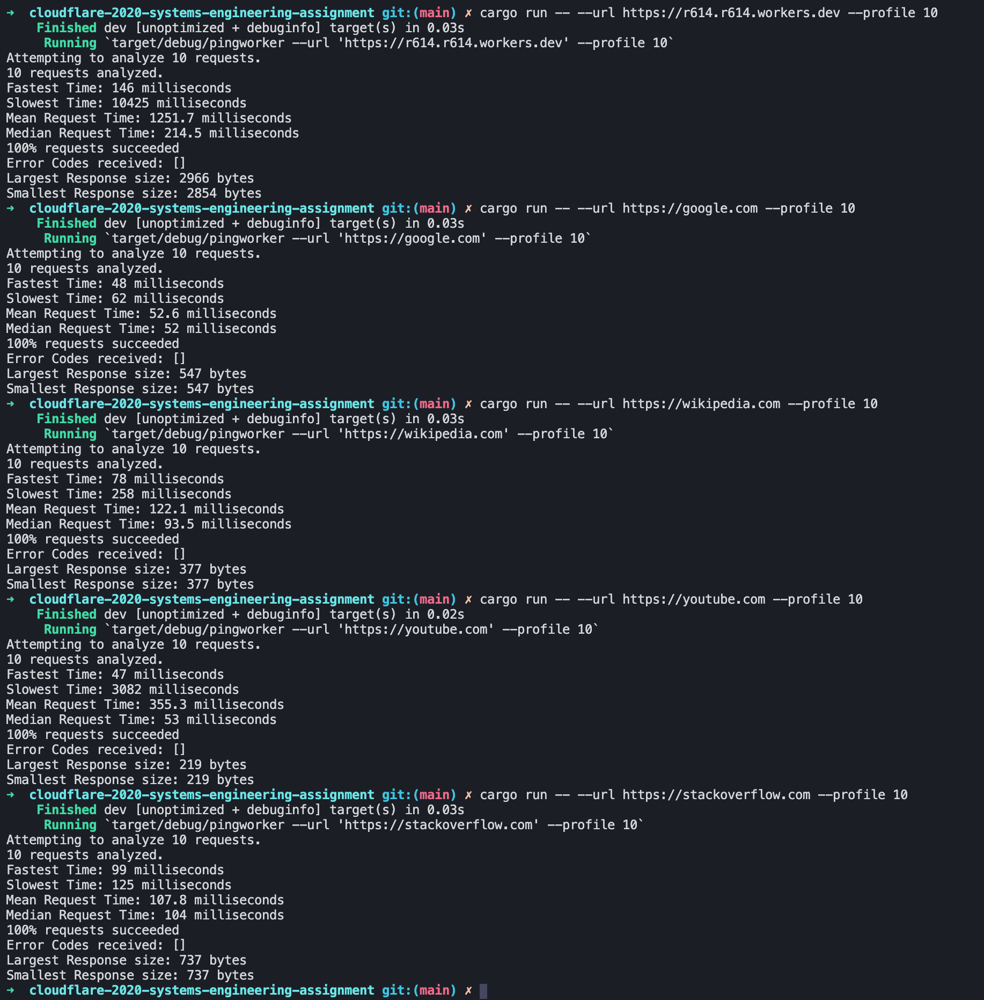

# Building and Running

The CLI is built using Rust and Cargo. You can run it by cloning the repository and using this command at the root:  

```
cargo run -- --url <Your URL(including https://)> --profile <Number of Requests to make>
```
# Analysis
The max request time for my website was much higher than any other website. I think this is primarily because the worker had to be spun up based on the fetch event, and this was further compounded by the internal API call it makes to Cloudfront to get the HTML template.  

Most of the other website had consistent results (+- 20ms with the median request time). I don't think the mean request time is a good indicator of request times, simply because it skews according to the initial request time, which might be extremely high compared to subsequent requests because of caching and initial load-balancing. Maybe running ~1000 requests and graphing Response time vs Number of Requests at that request time across different websites would be a much better indicator.  

# Screenshots  
